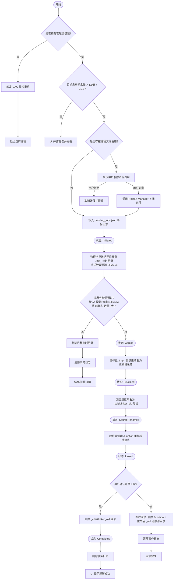
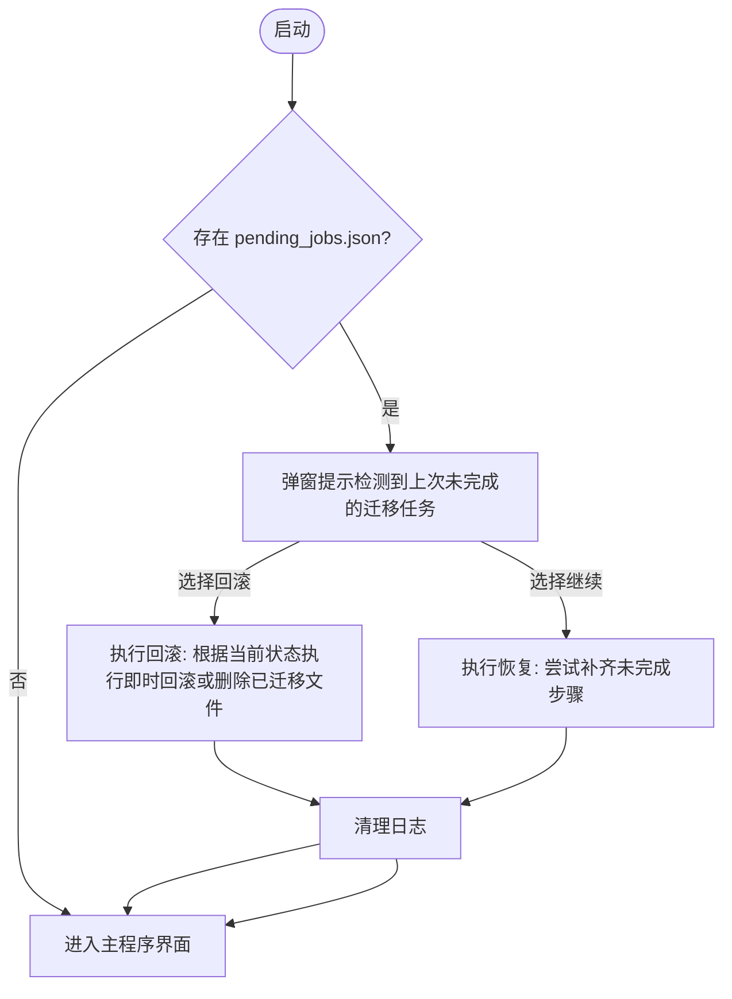
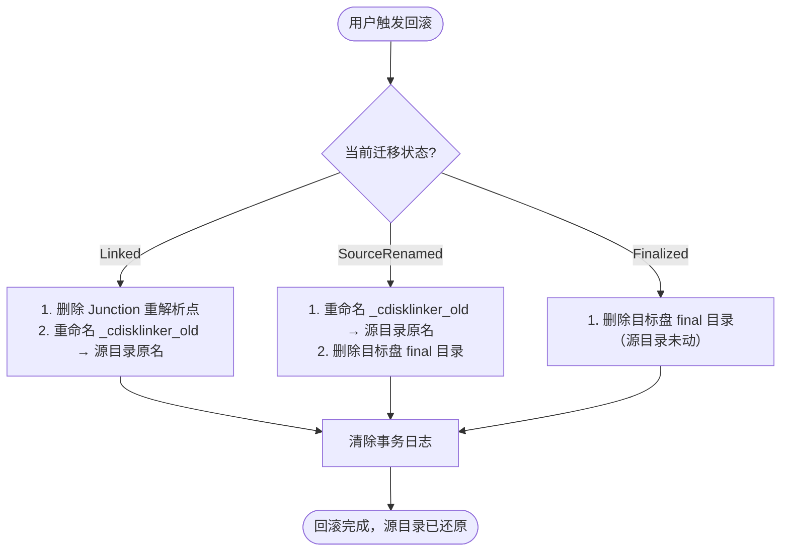
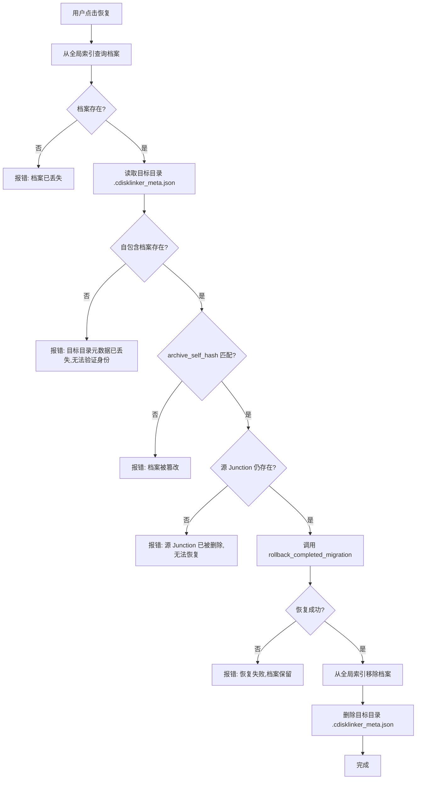
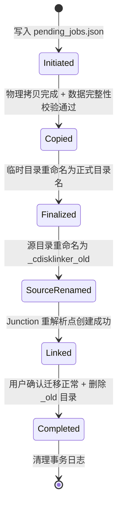

# 业务流程与状态机

> **TL;DR**: 关键流程：一键迁移流程、崩溃自动恢复流程、即时回滚流程。关键状态机：`MigrationStage` (迁移任务状态机，6 阶段)。⚠️ 关键状态约束：禁止跳过 Copied 阶段直接执行后续阶段，必须确保数据完整性后方可推进；源目录在创建 Junction 前仅重命名（不删除），允许即时回滚；final 成为唯一权威副本后，崩溃恢复绝不可删除。

---

## 业务流程

### 一键迁移流程 (One-click Migration Flow)

**触发条件**: 用户在 UI 勾选好待迁移文件夹，选定目标盘符，点击"▶ 一键迁移所选"按钮。

**参与者**: `ui` 界面模块、`scanner` 扫描器、`engine` 迁移引擎、`win_util` 原生工具、`journal` 事务日志。

**异常处理**:

| 步骤 | 异常场景 | 状态阶段 | 处理方式 | 数据安全 |
|------|----------|----------|----------|----------|
| 输入校验 | 源不存在/非目录/Junction/同盘/根目录/非NTFS | 未开始 | 返回错误，不启动迁移 | 源不变 |
| 空间校验 | 目标盘空间不足 | 未开始 | 返回错误 | 源不变 |
| 预统计 | 源目录为空 | 未开始 | 返回错误 | 源不变 |
| 目标检查 | 目标同名正式目录已存在 | 未开始 | 返回错误 | 源不变 |
| 写日志 | 写 Initiated 失败 | 未开始 | 返回错误 | 源不变 |
| 物理拷贝 | IO错误/空间满/权限不足 | Initiated | 删 tmp + 清日志 + 报错 | 源完整 |
| 完整性校验 | 默认模式：数量/大小/SHA256 不一致 | Initiated | 删 tmp + 清日志 + 报错 | 源完整 |
| 完整性校验 | 快速模式：数量/大小不一致 | Initiated | 删 tmp + 清日志 + 报错 | 源完整（无法检测磁盘静默位翻转） |
| 二次校验 | 文件数/大小不匹配 | Initiated | 删 tmp + 清日志 + 报错 | 源完整 |
| 写日志 | 写 Copied 失败 | Initiated | 删 tmp + 清日志 + 报错 | 源完整，可重试 |
| rename(tmp→final) | rename 失败 | Copied | **保留 tmp + 保留日志 + 报错** | 源完整，tmp完整，可重试 |
| 写日志 | 写 Finalized 失败 | Copied | 保留 final + 报错 | 源完整，final完整 |
| rename(源→_old) | rename 失败 | Finalized | **保留 final + 保留源 + 保留日志 + 报错** | 源完整，final完整，可重试 |
| 写日志 | 写 SourceRenamed 失败 | Finalized | 保留 final + 保留 _old + 报错 | final完整，_old完整 |
| 建 Junction | mklink 失败 | SourceRenamed | **保留 final + 保留 _old + 清日志 + 报错** | final完整，可即时回滚（rename _old→源名） |
| 写日志 | 写 Linked 失败 | SourceRenamed | 清理日志 | 迁移已完成 |
| 用户确认 | 用户选择回滚 | Linked | 即时回滚: 删 Junction + rename _old→源名 | 源完整还原 |
| 删除 _old | 删除失败（os error 5 等） | Linked | **尽力删除（best_effort）+ 进入 Completed + 清理日志 + 返回失败列表提示用户手动清理残留** | 迁移已完成，_old 部分残留可手动删除 |
| 写日志 | 写 Completed 失败 | Linked | 忽略 | 迁移已完成 |
| 清理日志 | 删除日志失败 | Completed | 忽略（迁移已成功） | 迁移已完成 |

---

### 崩溃自动恢复流程 (Crash Recovery Flow)

**触发条件**: 程序启动自检，发现运行目录下存在未清除的 `pending_jobs.json`。

---

### 即时回滚流程 (Instant Rollback Flow)

**触发条件**: 用户在迁移过程中发现软件运行异常，需要立即还原迁移。

**核心优势**: 因为源目录仅被重命名（非删除），回滚无需重新拷贝数据，是即时完成的"零拷贝回滚"。

| 状态 | 回滚操作 | 数据安全 | 耗时 |
|------|----------|----------|------|
| `Finalized` | 删除 final 目录（源目录完好无损） | 源完整，无风险 | 极快（仅删目录） |
| `SourceRenamed` | rename _old→源名 + 删除 final | 源完整还原 | 极快（仅 rename + 删目录） |
| `Linked` | 删 Junction + rename _old→源名 + 删除 final | 源完整还原 | 极快（仅删链接 + rename + 删目录） |

⚠️ 回滚时删除 final 目录是安全的，因为此时源目录（或 _old）是权威副本，final 仅是冗余副本。

⚠️ 回滚时删除 final 采用 best_effort 策略：部分文件删不掉（os error 5 等）不阻止回滚完成，返回失败列表提示用户手动清理残留。关键步骤（删 Junction / rename _old）失败仍报错。

---

### 档案恢复流程 (Archive Restore Flow)

**触发条件**: 用户在"迁移历史"面板点击某项的"恢复到源目录"按钮，将已迁移的数据搬回 C 盘原位置。

**前置条件**: 迁移档案存在且通过完整性校验（自包含档案存在 + 自哈希匹配 + 与全局索引一致）。

**核心复用**: 恢复核心逻辑直接调用已有的 `engine::rollback_completed_migration`，不重写。本次仅提供"自动定位 + 自动校验 + 自动清理档案"的包装层。

**误删处理**:

| 误删场景 | 表现 | 处理方式 |
|----------|------|----------|
| 误删自包含档案（`.cdisklinker_meta.json`） | `list_archives` 返回 `meta_file_exists: false`，UI 显示橙色警告 | 点击"修复档案"按钮，调用 `rebuild_meta_from_index` 从全局索引重建 |
| 误删全局索引（`migration_history.json`） | 历史列表为空，但目标目录仍有自包含档案 | 本次不实现自动重建（需扫描所有盘符，成本高），作为后续扩展点。用户可手动重新迁移同一目录。 |

**对应代码**:
- `src/migration_history.rs`（档案读写/校验/重建）
- `src/commands.rs` 的 `restore_from_archive` / `rebuild_archive_meta` command
- `src/engine.rs` 的 `rollback_completed_migration`（恢复核心逻辑）

---

## 状态机

### 迁移Stage状态机（6 阶段）

**初始状态**: `[*]` -> `Initiated`

### 状态说明

| 状态 | 含义 | 数据副本情况 | 允许的操作 |
|------|------|-------------|------------|
| `Initiated` | 事务已记录，拷贝进行中。 | 源=权威，tmp=不完整冗余 | 文件拷贝、校验 |
| `Copied` | 拷贝+校验通过，tmp 未改名。 | 源=权威，tmp=完整冗余 | rename tmp→final |
| `Finalized` | tmp 已改名 final，源未动。 | 源=权威，final=完整冗余 | rename 源→_old |
| `SourceRenamed` | 源已重命名为 _old，Junction 未建。 | _old=冗余，**final=唯一权威副本** | 创建 Junction |
| `Linked` | Junction 已建，_old 未删，等待用户确认。 | final=数据，_old=冗余，源=Junction链接 | 用户确认后删 _old / 即时回滚 |
| `Completed` | 用户已确认，_old 已删，迁移完成。 | final=数据，源=Junction链接 | 清理日志 |

### 转换规则

| 从 | 到 | 触发条件 | 副作用 |
|----|-----|----------|--------|
| `[*]` | `Initiated` | 用户点击迁移，通过输入校验 | 在目标盘建立 `.tmp_` 文件夹 |
| `Initiated` | `Copied` | 拷贝完毕（流式生成源端 Manifest）+ 完整性校验通过 + 二次校验通过。默认模式校验 SHA256+数量+大小；快速模式仅校验数量+大小 | 日志更新 `Stage = Copied` |
| `Copied` | `Finalized` | tmp 重命名为 final 成功 | 日志更新 `Stage = Finalized` |
| `Finalized` | `SourceRenamed` | 源目录重命名为 _cdisklinker_old 成功 | 日志更新 `Stage = SourceRenamed` |
| `SourceRenamed` | `Linked` | Junction 创建成功 | 日志更新 `Stage = Linked` |
| `Linked` | `Completed` | 用户确认迁移正常 + 删除 _old 成功 | 日志更新 `Stage = Completed` |
| `Completed` | `[*]` | 清理事务日志 | 销毁 `pending_jobs.json` |

### 禁止的转换

| 从 | 到 | 原因 |
|----|-----|------|
| `Initiated` | `Finalized`/`SourceRenamed`/`Linked`/`Completed` | 严禁跨过 `Copied`（校验）阶段。未校验就操作将导致数据不一致。 |
| `Copied` | `SourceRenamed`/`Linked`/`Completed` | 严禁跳过 rename(tmp→final) 阶段。final 不存在时后续步骤无意义。 |
| `Finalized` | `Linked`/`Completed` | 严禁跳过源重命名阶段。源还在时创建 Junction 会导致源与 Junction 共存冲突。 |
| `SourceRenamed` | `Completed` | 严禁跳过 Junction 创建阶段。未建立重定向，原软件无法通过原路径访问数据。 |
| 任意非 `Completed` | `[*]` | 严禁未完成迁移就清理日志。 |

### 崩溃恢复策略表

恢复核心原则：**绝不可删除可能是唯一权威数据副本的目录**。依据"日志状态 + 文件系统实际状态"推导动作。

| 日志状态 | 源实际状态 | tmp 实际状态 | final 实际状态 | _old 实际状态 | 恢复动作 |
|----------|-----------|-------------|---------------|-------------|----------|
| `Initiated` | 存在 | 存在(不完整) | 不存在 | 不存在 | 删 tmp，源保留，清日志 |
| `Initiated` | 不存在 | 存在 | 不存在 | 不存在 | ⚠️ 异常，保留 tmp 提示用户 |
| `Copied` | 存在且非Junction | 存在(完整) | 不存在 | 不存在 | **保留 tmp + 保留日志**，提示用户从 rename(tmp→final) 步骤恢复 |
| `Copied` | 不存在或已Junction | 存在(完整) | 不存在 | 不存在 | ⚠️ 保留 tmp，提示用户手动 rename+建链 |
| `Finalized` | 存在且非Junction | 不存在 | 存在(完整) | 不存在 | ✅ 自动 rename(源→_old) + 建 Junction |
| `Finalized` | 不存在 | 不存在 | 存在(完整) | 不存在 | ⚠️ 保留 final，提示用户手动建链 |
| `SourceRenamed` | 不存在 | 不存在 | 存在 | 存在 | ✅ 自动建 Junction |
| `SourceRenamed` | 不存在 | 不存在 | 存在 | 不存在 | ⚠️ 自动建 Junction（_old 已丢失，无法即时回滚） |
| `SourceRenamed` | 不存在 | 不存在 | 不存在 | 不存在 | ❌ 数据丢失，报错 |
| `Linked` | Junction | 不存在 | 存在 | 存在 | ✅ 提示用户确认迁移，确认后删 _old → Completed |
| `Linked` | Junction | 不存在 | 存在 | 不存在 | 清理日志（_old 已删，迁移完成） |
| `Completed` | Junction | 不存在 | 存在 | 不存在 | 清理日志 |

---

## 校验方式

迁移流程在 `Initiated → Copied` 转换时执行完整性校验，支持两种模式：

### 默认模式（完整校验）

- **校验项**：文件数量 + 逐项大小 + SHA256 哈希
- **实现**：拷贝时流式计算源端 SHA256（`copy_dir_recursive_with_hash`），拷贝完成后对目标端调用 `Manifest::generate` 重新计算哈希，再 `verify_against` 逐项比对
- **磁盘读取次数**：2 次（拷贝时算源端 + 目标端 generate）
- **能检测**：拷贝过程中的数据损坏、磁盘静默写入错误（位翻转）、文件截断
- **适用场景**：默认场景，对数据完整性要求高

### 快速模式（仅校验大小）

- **校验项**：文件数量 + 逐项大小
- **实现**：`Manifest::generate_size_only` 只收集元数据不算哈希，`verify_size_only` 仅比对数量与大小
- **磁盘读取次数**：1 次（仅拷贝本身）
- **能检测**：拷贝失败、文件截断、数量不一致
- **不能检测**：磁盘静默写入错误（位翻转）
- **适用场景**：用户信任磁盘完整性（新盘、已备份），追求迁移速度
- **切换约束**：仅在 `Idle` 状态可切换，迁移进行中禁用开关
- **回滚约束**：`rollback_completed_migration`（从 `Completed` 回滚）不支持快速模式，始终使用完整 SHA256 校验，确保回滚数据绝对正确

详见 `lessons/migration.md` 第 1.2 条。

---

## 变更记录

| 日期 | 变更内容 | 变更人 | 关联变更 |
|------|----------|--------|----------|
| 2026-07-21 | 初始版本，确立迁移状态机与一键迁移业务时序 | Antigravity | — |
| 2026-07-23 | 状态机细化：3 阶段→5 阶段（新增 SourceDeleted/Renamed）；新增崩溃恢复策略表；扩充异常处理表覆盖每步骤 | Antigravity | #TASK-crash-recovery 同步更新 constraints.md |
| 2026-07-23 | 删除源失败改为保留 Copied 状态（不再删 tmp），支持重试恢复；扫描大小改为异步计算 | Antigravity | #TASK-resume-and-async-scan |
| 2026-07-25 | V2 迁移流程：5 阶段→6 阶段（SourceDeleted/Renamed → Finalized/SourceRenamed，新增 Completed）；源目录改为重命名而非删除，支持即时回滚；新增即时回滚流程 | Antigravity | #TASK-v2-migration-flow 同步更新 constraints.md |
| 2026-07-26 | 新增"校验方式"章节，记录流式哈希优化与快速模式；更新流程图与异常处理表区分两种模式 | Antigravity | #TASK-sha256-opt 同步更新 boundaries.md、lessons/migration.md |
| 2026-08-03 | 删除 _old / 删除 final 改为 best_effort 策略：部分文件删不掉不阻止流程完成，返回失败列表提示用户手动清理；同步更新异常处理表与即时回滚流程说明 | Antigravity | #TASK-best-effort-delete 同步更新 lessons/migration.md |
