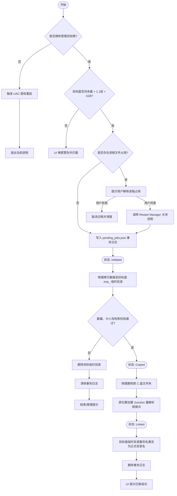
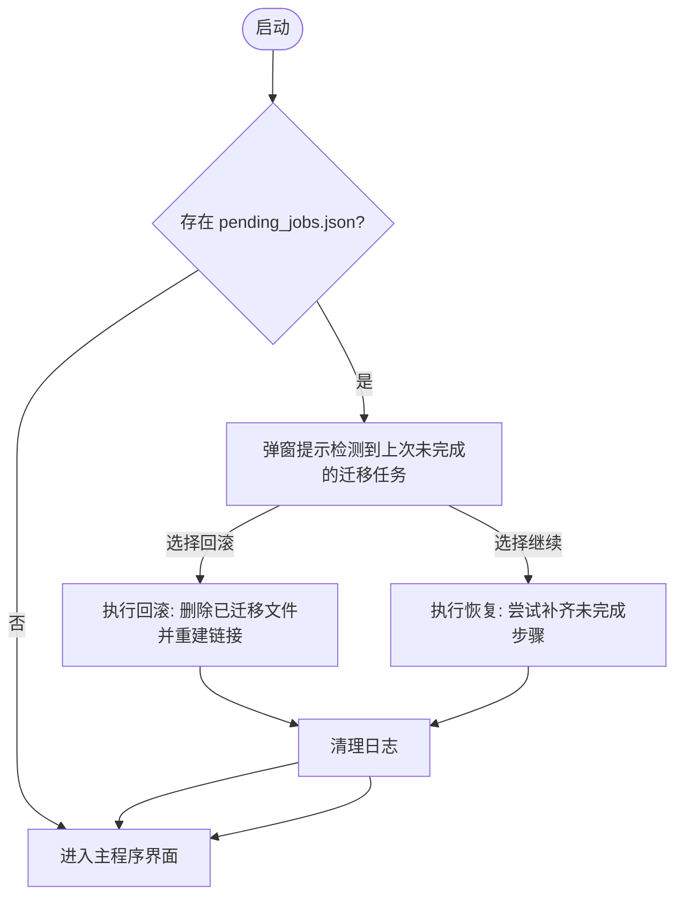
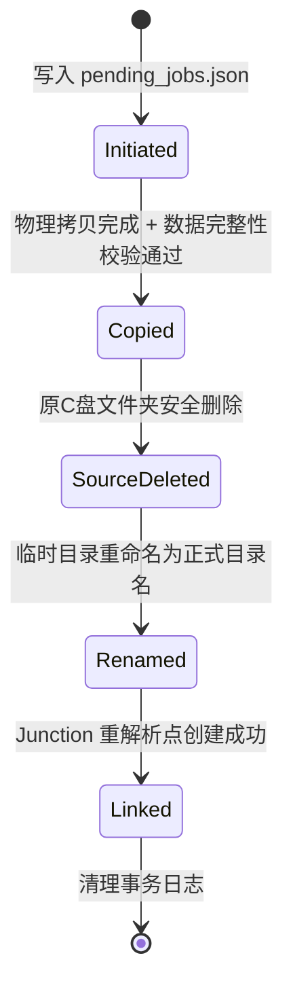

# 业务流程与状态机

> **TL;DR**: 关键流程：一键迁移流程、崩溃自动恢复流程。关键状态机：`MigrationStage` (迁移任务状态机，5 阶段)。⚠️ 关键状态约束：禁止跳过 Copied 阶段直接执行 Linked 阶段，必须确保数据完整性后方可删除源数据；源删除后 tmp/final 成为唯一副本，崩溃恢复绝不可删除。

---

## 业务流程

### 一键迁移流程 (One-click Migration Flow)

**触发条件**: 用户在 UI 勾选好待迁移文件夹，选定目标盘符，点击“▶ 一键迁移所选”按钮。

**参与者**: `ui` 界面模块、`scanner` 扫描器、`engine` 迁移引擎、`win_util` 原生工具、`journal` 事务日志。

**异常处理**:

| 步骤 | 异常场景 | 状态阶段 | 处理方式 | 数据安全 |
|------|----------|----------|----------|----------|
| 输入校验 | 源不存在/非目录/Junction/同盘/根目录/非NTFS | 未开始 | 返回错误，不启动迁移 | 源不变 |
| 空间校验 | 目标盘空间不足 | 未开始 | 返回错误 | 源不变 |
| 预统计 | 源目录为空 | 未开始 | 返回错误 | 源不变 |
| 目标检查 | 目标同名正式目录已存在 | 未开始 | 返回错误 | 源不变 |
| 写日志 | 写 Initiated 失败 | 未开始 | 返回错误 | 源不变 |
| 物理拷贝 | IO错误/空间满/权限不足 | Initiated | 删 tmp + 清日志 + 报错 | 源完整 |
| 完整性校验 | 数量/大小/哈希不一致 | Initiated | 删 tmp + 清日志 + 报错 | 源完整 |
| 二次校验 | 文件数/大小不匹配 | Initiated | 删 tmp + 清日志 + 报错 | 源完整 |
| 写日志 | 写 Copied 失败 | Initiated | 删 tmp + 清日志 + 报错 | 源完整，可重试 |
| 删除源 | remove_dir_all 失败（占用） | Copied | **保留 tmp + 保留日志 + 报错（含占用进程）** | 源保留，关闭进程后重试从删除步骤继续（无需重新拷贝） |
| 写日志 | 写 SourceDeleted 失败 | Copied | 保留 tmp + 报错 | tmp 完整，源已删，需手动 rename |
| rename | rename(tmp→final) 失败 | SourceDeleted | **保留 tmp + 保留日志 + 报错** | tmp 完整，源已删，需手动 rename |
| 写日志 | 写 Renamed 失败 | SourceDeleted | 保留 final + 报错 | final 完整，需手动建 Junction |
| 建 Junction | mklink 失败 | Renamed | 保留 final + 清日志 + 报错 | final 完整，需手动 mklink |
| 写日志 | 写 Linked 失败 | Renamed | 清理日志 | 迁移已完成 |
| 清理日志 | 删除日志失败 | Linked | 忽略（迁移已成功） | 迁移已完成 |

---

### 崩溃自动恢复流程 (Crash Recovery Flow)

**触发条件**: 程序启动自检，发现运行目录下存在未清除的 `pending_jobs.json`。

---

## 状态机

### 迁移Stage状态机（5 阶段）

**初始状态**: `[*]` -> `Initiated`

### 状态说明

| 状态 | 含义 | 数据副本情况 | 允许的操作 |
|------|------|-------------|------------|
| `Initiated` | 事务已记录，拷贝进行中。 | 源=权威，tmp=不完整冗余 | 文件拷贝、校验 |
| `Copied` | 拷贝+校验通过，源未删。 | 源=权威，tmp=完整冗余 | 删除源目录 |
| `SourceDeleted` | 源已删除，tmp 未改名。 | **tmp=唯一完整副本** | rename tmp→final |
| `Renamed` | tmp 已改名 final，Junction 未建。 | **final=唯一完整副本** | 创建 Junction |
| `Linked` | Junction 已建，迁移完成。 | final=数据，源=Junction链接 | 清理日志 |

### 转换规则

| 从 | 到 | 触发条件 | 副作用 |
|----|-----|----------|--------|
| `[*]` | `Initiated` | 用户点击迁移，通过输入校验 | 在目标盘建立 `.tmp_` 文件夹 |
| `Initiated` | `Copied` | 拷贝完毕 + 哈希/数量/大小校验通过 + 二次校验通过 | 日志更新 `Stage = Copied` |
| `Copied` | `SourceDeleted` | 源目录安全删除成功 | 日志更新 `Stage = SourceDeleted` |
| `SourceDeleted` | `Renamed` | tmp 重命名为 final 成功 | 日志更新 `Stage = Renamed` |
| `Renamed` | `Linked` | Junction 创建成功 | 日志更新 `Stage = Linked` |
| `Linked` | `[*]` | 清理事务日志 | 销毁 `pending_jobs.json` |

### 禁止的转换

| 从 | 到 | 原因 |
|----|-----|------|
| `Initiated` | `SourceDeleted`/`Renamed`/`Linked` | 严禁跨过 `Copied`（校验）阶段。未校验就删源将导致灾难性数据丢失。 |
| `Copied` | `Renamed`/`Linked` | 严禁跳过源删除阶段。源还在时 rename 会导致源与 final 共存，状态混乱。 |
| `SourceDeleted` | `Linked` | 严禁跳过 rename 阶段。final 不存在时 Junction 无法创建。 |
| 任意非 `Linked` | `[*]` | 严禁未完成 Junction 就清理日志。不建立重定向，原软件无法通过原路径访问数据。 |

### 崩溃恢复策略表

恢复核心原则：**绝不可删除可能是唯一数据副本的目录**。依据"日志状态 + 文件系统实际状态"推导动作。

| 日志状态 | 源实际状态 | tmp 实际状态 | final 实际状态 | 恢复动作 |
|----------|-----------|-------------|---------------|----------|
| `Initiated` | 存在 | 存在(不完整) | 不存在 | 删 tmp，源保留，清日志 |
| `Initiated` | 不存在 | 存在 | 不存在 | ⚠️ 异常，保留 tmp 提示用户 |
| `Copied` | 存在且非Junction | 存在(完整) | 不存在 | **保留 tmp + 保留日志**，提示用户重新迁移同目录从删除步骤恢复 |
| `Copied` | 不存在或已Junction | 存在(完整) | 不存在 | ⚠️ 保留 tmp，提示用户手动 rename+建链 |
| `SourceDeleted` | 不存在 | 存在 | 不存在 | ✅ 自动 rename + 建 Junction，清日志 |
| `SourceDeleted` | 不存在 | 不存在 | 不存在 | ❌ 数据丢失，报错 |
| `Renamed` | 不存在 | 不存在 | 存在 | ✅ 自动建 Junction，清日志 |
| `Renamed` | 不存在 | 不存在 | 不存在 | ❌ 数据丢失，报错 |
| `Linked` | Junction | 不存在 | 存在 | 清理日志 |

---

## 变更记录

| 日期 | 变更内容 | 变更人 | 关联变更 |
|------|----------|--------|----------|
| 2026-07-21 | 初始版本，确立迁移状态机与一键迁移业务时序 | Antigravity | — |
| 2026-07-23 | 状态机细化：3 阶段→5 阶段（新增 SourceDeleted/Renamed）；新增崩溃恢复策略表；扩充异常处理表覆盖每步骤 | Antigravity | #TASK-crash-recovery 同步更新 constraints.md |
| 2026-07-23 | 删除源失败改为保留 Copied 状态（不再删 tmp），支持重试恢复；扫描大小改为异步计算 | Antigravity | #TASK-resume-and-async-scan |
