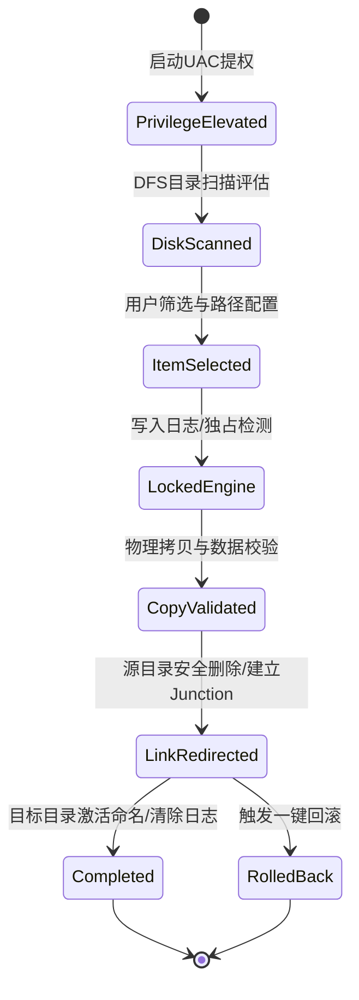
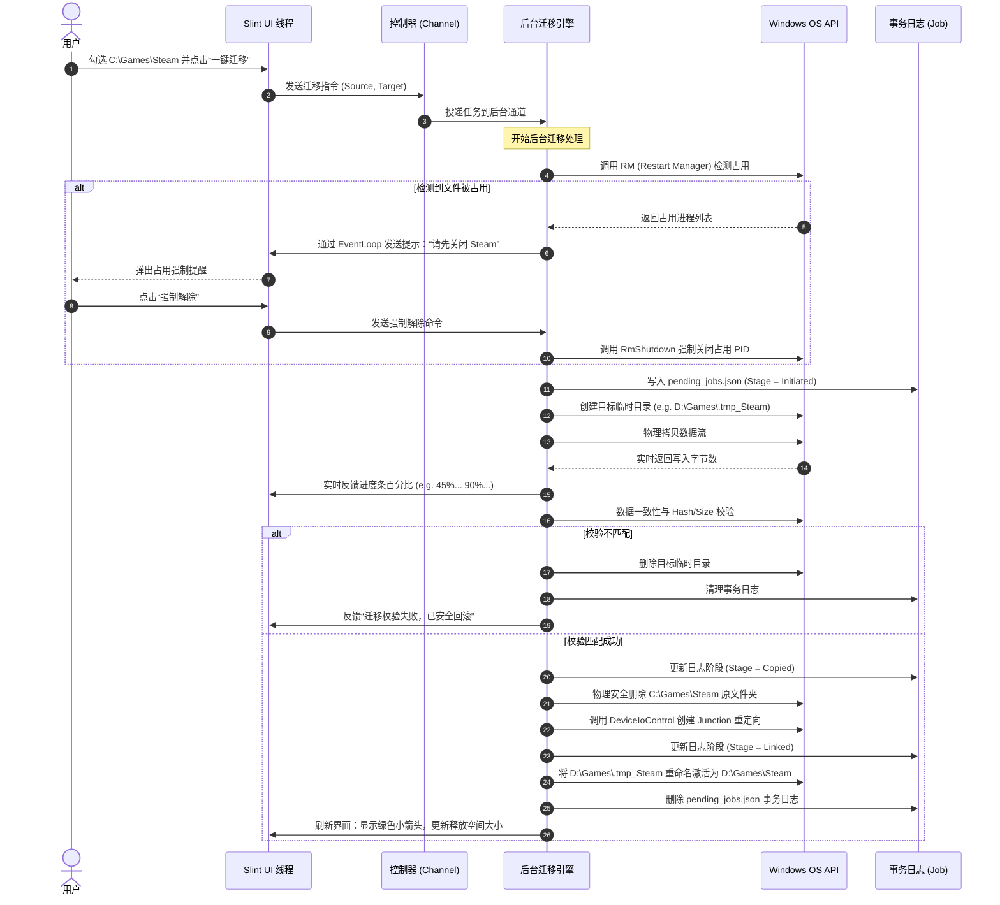

# C盘移链助手 (CDiskLinker) - Rust 技术栈详细设计文档

本篇文档详细阐述了采用 Rust 作为核心技术栈的系统架构设计、核心模块划分、关键 Windows API 调用方式及流程设计。

---

## 1. 业务架构设计

本系统的核心业务是安全、无损地实现 Windows 系统盘 C 盘空间的转移重定向。整个业务生命周期与实体边界定义如下：

### 1.1 业务生命周期 (Business Lifecycle)
系统的业务流程严格遵循以下生命周期的流转：



### 1.2 业务规则与实体定义
- **待迁移实体 (Migration Entry)**：代表 C 盘上的一个候选目录。包含物理路径、虚拟大小、磁盘实际大小（排除已有链接和稀疏文件的虚拟膨胀）、危险评级（安全/警告/禁止）。
- **目录评级规则 (Directory Rating Rule)**：
  - **安全 (Safe)**：非系统关键大文件夹，如用户手动安装在 C 盘的第三方游戏、本地文档、下载缓存。
  - **警告 (Warning)**：如 `C:\Users\用户名\AppData` 下的目录。内含应用软件的配置信息，迁移可能导致特定应用因绝对路径加载硬编码而报错。需要强制红色弹窗提示。
  - **禁止 (Forbidden)**：硬编码系统目录（黑名单），必须在扫描结果中置灰并拦截迁移。

---

## 2. 技术架构设计

本系统采用极轻量级的 Rust 本地客户端架构，彻底避免庞大的 Web 运行时或 .NET 运行环境。

### 2.1 多线程与异步交互模型
为了保证 UI 界面的流畅度（避免扫描和物理拷贝文件时界面卡死），系统必须采用**主线程 GUI + 后台工作线程 Engine** 的异步架构：

```plaintext
+-------------------------------------------------------------------+
|                           主进程 (Main Process)                    |
|                                                                   |
|   +--------------------------+     (Event)     +--------------+   |
|   |  Slint GUI 主线程         | -------------> | 后台工作线程  |   |
|   |  - 渲染本地原生 UI 窗口   |                |  - DFS 扫描  |   |
|   |  - 处理点击与树形控件状态 | <------------- |  - 物理 Copy |   |
|   |  - 运行 Slint 事件循环   |   (Channel)    |  - Win32 API |   |
|   +--------------------------+                 +--------------+   |
|                 ^                                      |          |
|                 | (slint::invoke_from_event_loop)      v          |
|                 +--------------------------------------+          |
+-------------------------------------------------------------------+
```

- **UI 线程 (Main GUI Thread)**：运行 Slint 引擎。它持有一个 `slint::Weak` 的弱引用指针，用于在后台线程完成工作时，安全地把数据和 UI 更新闭包调度回主 UI 线程执行。
- **后台线程 (Worker Thread Pool)**：利用 `std::thread` 或 Tokio 的轻量单线程运行时处理高负荷 I/O。通过 `std::sync::mpsc` 通道接收 UI 发出的指令，并在运行中实时将进度百分比和滚动日志字符串发送回 UI。

### 2.2 底层 Win32 接口交互层 (Windows API Wrapper)
系统核心操作必须通过 Rust 官方 `windows` crate 调用底层 COM 与 Windows API。

#### 2.2.1 目录联接 (Directory Junction) NTFS 结构体封装
在 Windows 原生底层中，建立目录联接是通过向空文件夹写入特定的重解析数据。在 Rust 中，我们需要手动映射 C 语言中的 `REPARSE_DATA_BUFFER` 字节布局：

```rust
use std::os::windows::prelude::*;

// 强制采用 C 语言内存字节对齐，作为向底层 Win32 API 传递的二进制缓冲区
#[repr(C)]
pub struct REPARSE_DATA_BUFFER {
    pub ReparseTag: u32,           // 重解析标识，Junction 固定为 0xA0000003
    pub ReparseDataLength: u16,    // 缓冲区后续数据的总长度
    pub Reserved: u16,             // 保留字段，必须填 0
    // MountPointReparseBuffer 字段
    pub SubstituteNameOffset: u16, // 替代名称偏移（带有 \??\ 前缀的本地路径）
    pub SubstituteNameLength: u16, // 替代名称长度
    pub PrintNameOffset: u16,      // 打印名称偏移（用户友好路径）
    pub PrintNameLength: u16,      // 打印名称长度
    pub PathBuffer: [u16; 16384],  // 实际路径数据宽字符缓冲（UTF-16）
}
```

#### 2.2.2 提权启动逻辑
若程序检测到当前不具备管理员特权，必须通过以下系统机制自我重启：
```rust
use windows::core::PCWSTR;
use windows::Win32::UI::Shell::ShellExecuteW;
use windows::Win32::UI::WindowsAndMessaging::SW_SHOW;

pub fn elevate_self() {
    let current_exe = std::env::current_exe().unwrap();
    let file_path: Vec<u16> = current_exe.to_str().unwrap().encode_utf16().chain(Some(0)).collect();
    let operation: Vec<u16> = "runas\0".encode_utf16().collect(); // 触发 UAC 提权

    unsafe {
        ShellExecuteW(
            None,
            PCWSTR(operation.as_ptr()),
            PCWSTR(file_path.as_ptr()),
            None,
            None,
            SW_SHOW,
        );
    }
}
```

---

## 3. 核心业务流程与时序图

以下是完整的双阶段安全迁移流程图，描述了各个模块在多线程调度下的交互过程：



---

## 4. 关键代码模型与数据结构

为了指导开发实现，定义以下核心 Rust 数据结构与接口契约：

### 4.1 实体模型 (Entity Domain Model)

```rust
use std::path::PathBuf;

/// 可迁移项实体
#[derive(Debug, Clone)]
pub struct ScanEntry {
    pub path: PathBuf,
    pub name: String,
    pub size_in_bytes: u64,
    pub actual_size_on_disk: u64,
    pub rating: DirectoryRating,
}

/// 目录评级等级
#[derive(Debug, Clone, Copy, PartialEq)]
pub enum DirectoryRating {
    Safe,       // 可以安全迁移
    Warning,    // AppData 等配置区，迁移有风险
    Forbidden,  // 黑名单内的核心目录，禁止迁移
}
```

### 4.2 接口契约定义

#### 4.2.1 磁盘扫描端口 (Scanner Port)
```rust
use std::path::Path;

pub trait DiskScanner {
    /// 深度优先扫描指定根路径下的可迁移目录，排除系统黑名单
    fn scan_directory(&self, root_path: &Path) -> Vec<ScanEntry>;
}
```

#### 4.2.2 迁移引擎端口 (Engine Port)
```rust
use std::path::Path;

pub trait MigrationEngine {
    /// 双阶段安全迁移核心接口
    fn migrate(&self, entry: &ScanEntry, target_drive: &str) -> Result<(), String>;
    
    /// 根据本地事务日志执行中断恢复或安全回滚
    fn rollback_previous_session(&self) -> Result<(), String>;
}
```

#### 4.2.3 异常解除端口 (WinUtil Port)
```rust
use std::path::Path;

pub trait WinSystemUtility {
    /// 查询指定目录的占用进程列表，返回占用进程名称和 PID
    fn query_file_locks(&self, path: &Path) -> Result<Vec<(u32, String)>, String>;
    
    /// 根据 PID 列表解除系统锁定
    fn force_release_locks(&self, pids: &[u32]) -> Result<(), String>;
    
    /// 检测当前进程是否具备系统管理员特权
    fn check_administrator_privileges(&self) -> bool;
}
```

---

## 5. 项目工程结构规范
```plaintext
CDiskLinker/
├── Cargo.toml            # 统一工作空间配置
├── ui/                   # GUI 视图层
│   └── appwindow.slint   # Slint 声明式组件设计
├── src/                  # 核心架构层
│   ├── main.rs           # 控制器，主线程 GUI 绑定与多线程 Channel 管道监听
│   ├── scanner.rs        # 智能扫描引擎实现（包含 DFS 以及黑名单拦截）
│   ├── engine.rs         # 双阶段安全物理拷贝与数据比对引擎
│   ├── journal.rs        # 事务日志管理器（实现基于 pending_jobs.json 的状态机流转）
│   └── win_util.rs       # 原生 Windows API 交互包装（Junction、Restart Manager 及提权）
└── app.manifest          # Windows 配置文件，强制声明 requireAdministrator
```
